# Festiq — Event Booking System

A full-stack MERN event booking platform where users can browse events, book tickets, and receive in-app notifications. Admins can manage events, pricing, and availability.

---

## Features

- Browse events with category filter and search
- JWT authentication (register / login)
- Book tickets with payment UI
- My Bookings page with cancel option
- In-app notifications
- Instant booking confirmation notification
- Instant cancellation notification with refund message
- Admin panel: create, edit, delete, activate/deactivate events
- Light and dark theme toggle
- Fully responsive UI

---

## Screenshots

### Home Page
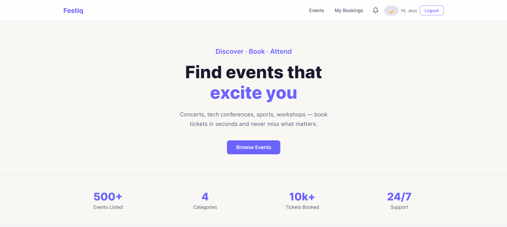
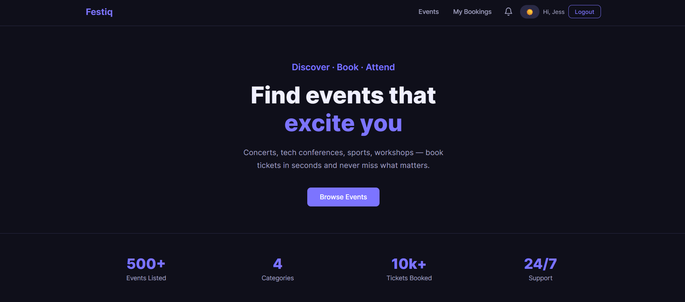

### Events Page
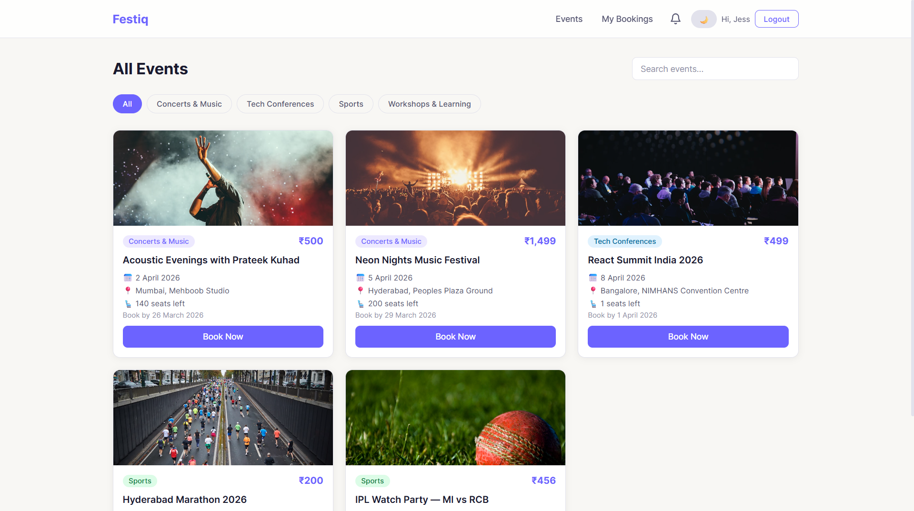

### Event Detail
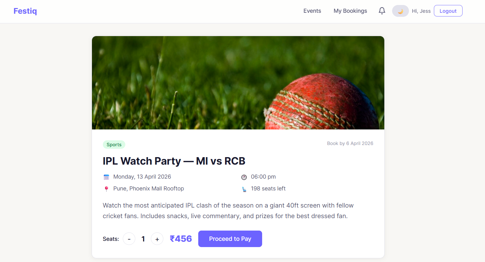

### Mock Payment
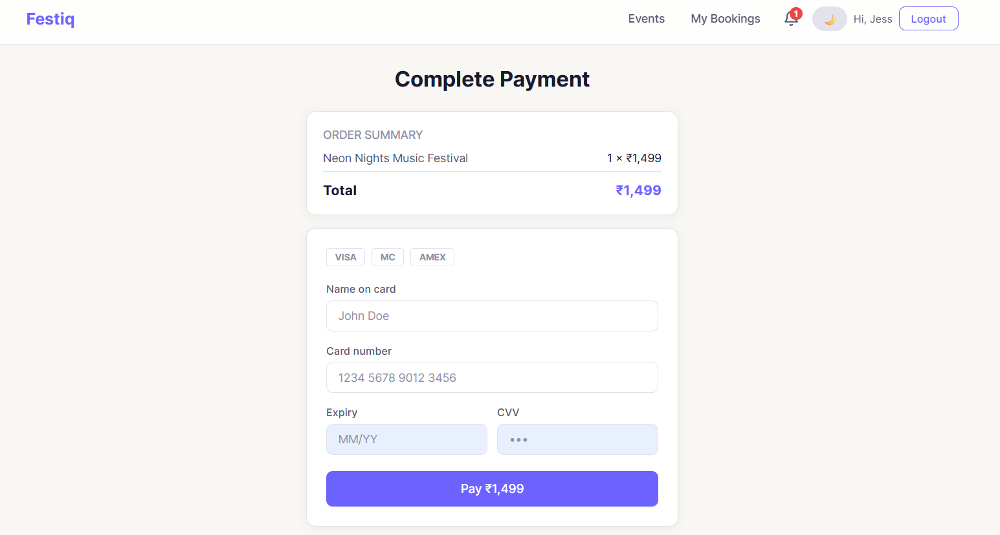

### Payment Success
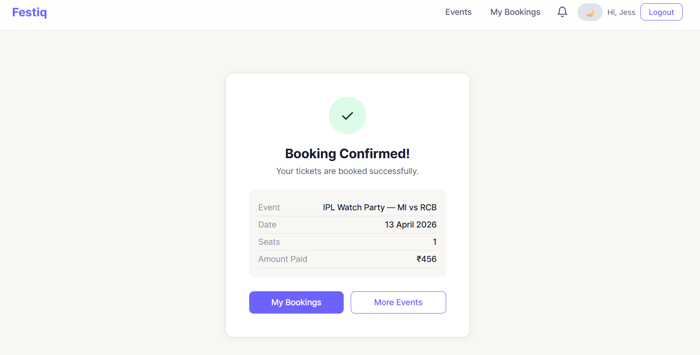

### My Bookings
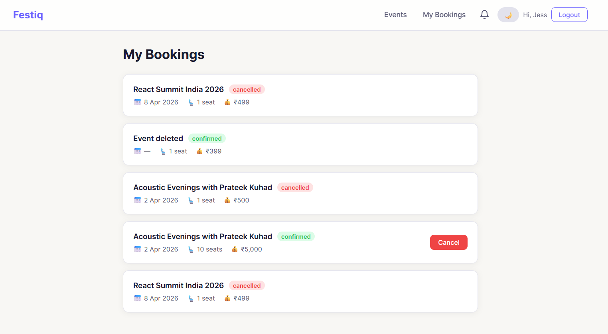

### Notifications
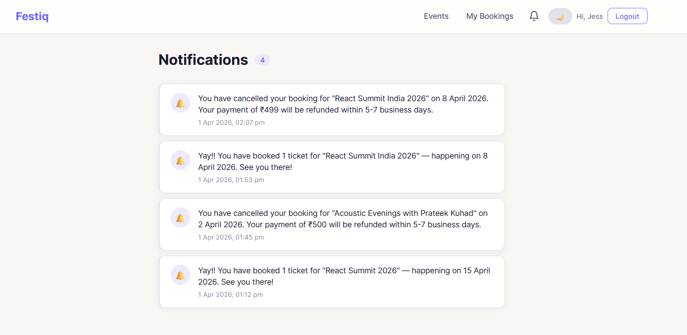

### Admin Dashboard
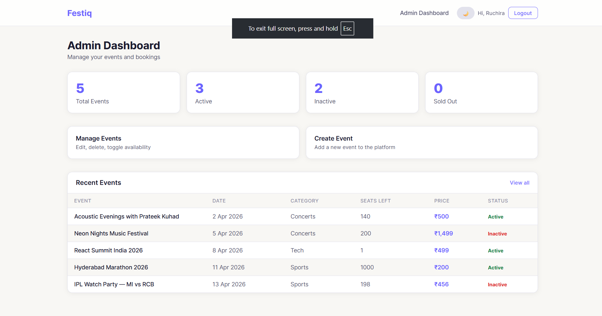

### Manage Events
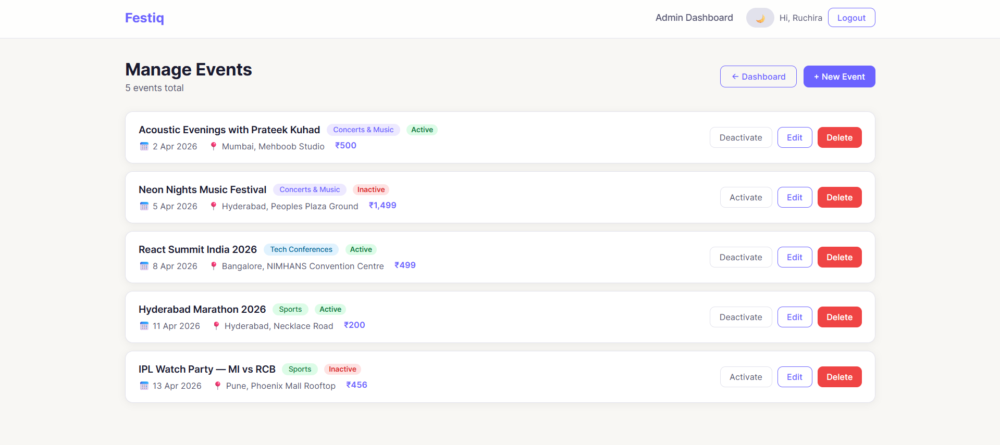

### Create Event
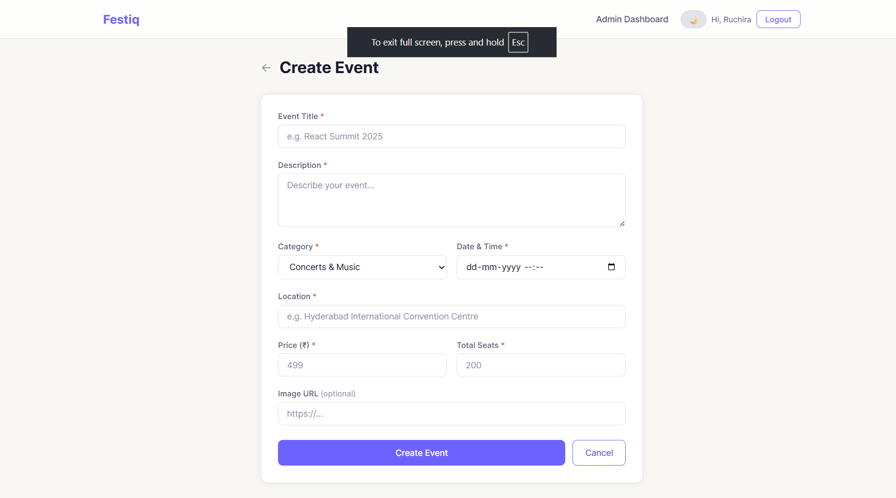

### Login/Register
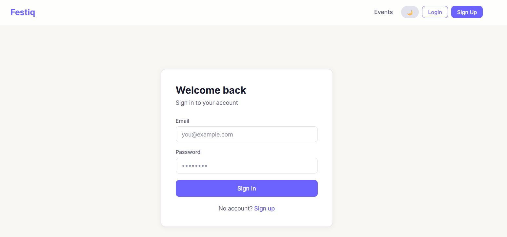
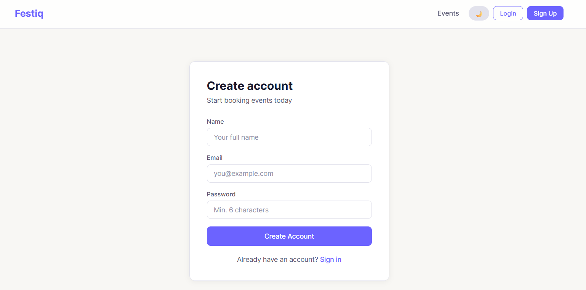


## Tech Stack

| Layer       | Technology                           |
|-------------|--------------------------------------|
| Frontend    | React 18, Vite, React Router v6      |
| Backend     | Node.js v20, Express.js v4           |
| Database    | MongoDB v7, Mongoose v8              |
| Auth        | JWT + bcryptjs                       |
| Scheduling  | node-cron                            |
| Payments    | Mock payment flow (Stripe-ready)     |
| Styling     | Custom CSS variables (no framework)  |

---

## Prerequisites

Make sure these are installed before starting:

| Tool       | Version  | Download                                       |
|------------|----------|------------------------------------------------|
| Node.js    | v20.x    | https://nodejs.org                             |
| npm        | v10.x    | Comes with Node                                |

Check your installed versions:
```bash
node -v
npm -v
```

---

## Local Setup

### 1. Clone the repository
```bash
git clone https://github.com/Ruchira1214/event-booking.git
cd event-booking
```

### 2. Set up the backend
```bash
cd server
npm install
```

Create a `.env` file inside the `server/` folder:
```env
PORT=5000
MONGO_URI=mongodb://localhost:27017/eventbooking
JWT_SECRET=replace_this_with_a_long_random_string
CLIENT_URL=http://localhost:5173
```

Start the backend server:
```bash
npm run dev
```

You should see:
```
Server running on port 5000
MongoDB connected
```

### 3. Set up the frontend

Open a new terminal:
```bash
cd client
npm install
npm run dev
```

Open your browser at: `http://localhost:5173`

---

### 4. Create an admin account

Register a normal account at `http://localhost:5173/register`, then open MongoDB Compass and connect to `mongodb://localhost:27017`.

- Open the `eventbooking` database
- Open the `users` collection
- Find your user document
- Edit the `role` field from `"user"` to `"admin"`
- Click Update

Log out and log back in — the Admin link will appear in the navbar.

---

## Running the App

Every time you want to run the project you need two terminals open:

| Terminal   | Command                    | What it does               |
|------------|----------------------------|----------------------------|
| Terminal 1 | `cd server && npm run dev` | Runs backend on port 5000  |
| Terminal 2 | `cd client && npm run dev` | Runs frontend on port 5173 |

MongoDB runs automatically as a Windows service — no separate terminal needed.

---

## Scripts

### Backend (`server/`)
```bash
npm run dev     # Start with nodemon
npm start       # Start without nodemon
```

### Frontend (`client/`)
```bash
npm run dev     # Start server
```

---

## Environment Variables

| Variable    | Description                        | Example                                    |
|-------------|------------------------------------|--------------------------------------------|
| PORT        | Backend server port                | 5000                                       |
| MONGO_URI   | MongoDB connection string          | mongodb://localhost:27017/eventbooking     |
| JWT_SECRET  | Secret key for signing JWTs        | any long random string                     |
| CLIENT_URL  | Frontend URL for CORS              | http://localhost:5173                      |

---

## Database

- Name: `eventbooking`
- Created automatically by MongoDB on first run
- Collections: `users`, `events`, `bookings`, `notifications`

---

## Mock Payment

Stripe is not used due to regional restrictions in India. The mock payment page simulates a real payment form with card number formatting, expiry and CVV validation, a processing delay, and a success redirect with booking confirmation. No real money is charged.

To integrate real Stripe later:
1. `npm install stripe` in server
2. Replace `POST /api/bookings/create` with a Stripe Checkout session
3. Add `STRIPE_SECRET_KEY` to `.env`

---

## Known Limitations

- Payment is mocked — no real payment gateway
- No image upload — image URL input only
- No seat selection map — quantity selector only
- No email notifications — in-app only

---

## API Endpoints

### Auth
| Method | Route                  | Access | Description       |
|--------|------------------------|--------|-------------------|
| POST   | `/api/auth/register`   | Public | Register new user |
| POST   | `/api/auth/login`      | Public | Login             |

### Events
| Method | Route              | Access | Description                        |
|--------|--------------------|--------|------------------------------------|
| GET    | `/api/events`      | Public | Get all events (filter + search)   |
| GET    | `/api/events/:id`  | Public | Get single event                   |
| POST   | `/api/events`      | Admin  | Create event                       |
| PUT    | `/api/events/:id`  | Admin  | Update event                       |
| DELETE | `/api/events/:id`  | Admin  | Delete event                       |

### Bookings
| Method | Route                      | Access | Description        |
|--------|----------------------------|--------|--------------------|
| POST   | `/api/bookings/create`     | User   | Create booking     |
| GET    | `/api/bookings/my`         | User   | Get my bookings    |
| PATCH  | `/api/bookings/:id/cancel` | User   | Cancel booking     |

### Notifications
| Method | Route                            | Access | Description          |
|--------|----------------------------------|--------|----------------------|
| GET    | `/api/notifications`             | User   | Get my notifications |
| GET    | `/api/notifications/unread-count`| User   | Get unread count     |
| PATCH  | `/api/notifications/mark-read`   | User   | Mark all as read     |

---